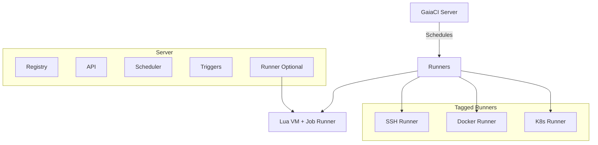

# GaiaCI 🌱

**GaiaCI** is a lightweight, extensible CI/CD and automation engine built with Rust and Lua. It is designed for local-first execution, offline resilience, and powerful automation beyond traditional code builds — including support for sensors, home automation, and edge devices.

---

## 🚀 Goals

- **Programmable pipelines** using Lua instead of YAML
- **Event-driven architecture** — schedule pipelines via cron, Git events, sensor triggers, etc.
- **Low-resource footprint** — ideal for homelabs, ARM devices, and air-gapped environments
- **Extensible runners** — local, SSH, Docker, Kubernetes
- **Embedded jobs** — write job logic directly in Lua, not just shell scripts
- **Secure secrets management** — local or cloud-synced
- **Self-hostable** server with REST API and optional runner mode

---

## ✨ Features

| Feature                | Status   |
|------------------------|----------|
| Lua pipelines          | ✅       |
| Shell jobs             | ✅       |
| Embedded jobs          | ✅       |
| Conditional jobs       | ✅       |
| Job parameterization   | 🚧       |
| Triggers (cron, git)   | 🚧       |
| Server mode            | 🚧       |
| Secrets management     | 🚧       |
| Web/TUI dashboard      | 🚧       |

---

## 🔧 Architecture Overview


---

## 📄 Lua Pipelines

Pipelines are real Lua scripts, not static YAML. This means you can use variables, functions, and conditionals:

```lua
return {
  name = "deploy-plants",
  on = { schedule = "0 6 * * *" },
  env = { PLANT_ID = "42" },
  jobs = {
    check_moisture = {
      run = function(env)
        print("Moisture check for plant", env.PLANT_ID)
        return { moisture = 22 }
      end
    },
    water = {
      if_ = function(env)
        return tonumber(env.moisture) < 30
      end,
      run = "./scripts/water.sh"
    }
  }
}
```

**Supports:**
- `run = function(env)` for embedded jobs
- `run = "shell command"` for external tools
- `if_ = function(env)` for conditionals
- *(Planned)* `job = "other_job"` for job composition and parameterization

---

## 📦 Getting Started

```bash
git clone https://github.com/wjpin84/gaiaci
cd gaiaci
cargo run --bin gaia run
```

Expected layout:
```
your-project/
└── .gaiaci/
    ├── pipeline.lua
    ├── jobs/
    └── .luarocks/  # optional
```

---

## 🧪 Test

```bash
cargo test
```

Tests simulate real Lua pipelines and assert output.

---

## 🔌 Extending GaiaCI

GaiaCI is designed with extensibility in mind:

- Add new **job types** using the `JobExecutor` trait
- Add **trigger sources** (cron, git, webhooks, sensors)
- Add **secret backends** or **runner targets**
- Expose custom functions into Lua safely with [`mlua`](https://docs.rs/mlua/)

**Example: Add a custom Lua function**
```rust
lua.globals().set("my_custom", lua.create_function(|_, ()| {
    println!("Hello from Rust!");
    Ok(())
})?)?;
```

---

## 📚 Roadmap Highlights

- [x] Lua-based pipeline loader
- [x] Shell + embedded jobs
- [x] `.luarocks` support in runner
- [x] Integration tests
- [ ] Server runner (`gaiad`)
- [ ] Job tagging and distribution
- [ ] Secure secrets store
- [ ] Triggers and webhook endpoints
- [ ] Cron scheduler
- [ ] Web UI or TUI dashboard

---

## 🗂️ Pipeline Registration & Job Referencing

- **All pipelines must be registered with the GaiaCI server using the CLI and must have a unique name.**
- **Jobs are referenced by `pipeline_name/job_name`** (e.g., `"ci/build"`).
- **Pipelines** can be organized in folders/namespaces for clarity and reuse.
- **Jobs do not support folders/namespaces**—they are always referenced as part of a pipeline.

**Example: Referencing Jobs Across Pipelines**

```lua
return {
  name = "deploy-app",  -- Unique pipeline name
  jobs = {
    build = { job = "ci/build" },           -- job 'build' from pipeline 'ci'
    test = { job = "ci/test" },             -- job 'test' from pipeline 'ci'
    deploy = { job = "deployments/prod/deploy" } -- job 'deploy' from pipeline 'deployments/prod'
  }
}
```

- To register a pipeline, use the CLI:
    ```bash
    gaia pipeline register .gaiaci/pipeline.lua
    ```
- The server manages pipeline and job lookup, and distributes jobs to runners.

**Benefits:**
- Centralized, reusable job definitions.
- Pipelines can be organized in folders/namespaces and must have unique names.
- Jobs are always referenced by their pipeline and job name, never by folder.

---

## 🌐 Remote Job Submission & Git Integration (Planned)

- Pipelines are registered with the GaiaCI server using the CLI, not by direct HTTP POST.
- The CLI can support registering pipelines from local files or Git repositories.
- Example:
    ```bash
    gaia pipeline register --git git@github.com:user/repo.git --path ci/pipeline.lua
    ```
- The server fetches the pipeline and distributes it to available runners for execution.

---

## 🛰️ Communication Protocol

- GaiaCI uses a minimal, efficient gRPC (protobuf-based) protocol for communication between the server and runners.
- This reduces resource usage compared to HTTP/REST and enables fast, strongly-typed messaging.
- The CLI and server may still expose HTTP endpoints for user-facing APIs, but all core runner/server communication is gRPC.

---

## 🤝 Contributing

This project is early-stage but open to contributors. If you’re interested in:
- Edge automation
- DevOps on ARM devices
- Lua DSLs
- CI/CD without the bloat

Please [reach out](https://github.com/wjpin84/gaiaci/issues) or open an issue.

See [CONTRIBUTING.md](CONTRIBUTING.md) for guidelines.

---


## 🛠️ Advanced Features & Planned Enhancements

GaiaCI is designed for flexibility, performance, and modern CI/CD needs. Planned and proposed features include:

| Feature                | Description                                      | Status   |
|------------------------|--------------------------------------------------|----------|
| Artifacts              | Share files between jobs/steps                   | 🚧       |
| Caching                | Speed up builds with persistent caches           | 🚧       |
| Matrix Builds          | Run jobs with multiple parameter sets            | 🚧       |
| Manual Gates           | Require approval for certain jobs                | 🚧       |
| Notifications          | Slack/email/webhook integration                  | 🚧       |
| Retry/Timeout          | Configurable retries and timeouts                | 🚧       |
| Templates              | Reusable pipeline/job definitions                | 🚧       |
| Permissions            | Role-based access control                        | 🚧       |
| Audit Logging          | Track all actions and accesses                   | 🚧       |
| Auto-Scaling           | Dynamic runner management                        | 🚧       |
| Dashboard              | Web/TUI UI for monitoring                        | 🚧       |
| Visualization          | Pipeline/job dependency graphs                   | 🚧       |
| Secret Policies        | Restrict secret/env access                       | 🚧       |
| Plugin System          | User-extensible with plugins                     | 🚧       |

---

### Example: Matrix Builds

```lua
return {
  name = "test-matrix",
  matrix = {
    os = {"ubuntu-latest", "windows-latest"},
    rust = {"stable", "nightly"}
  },
  jobs = {
    test = {
      run = "cargo test"
    }
  }
}
```

---

### Example: Artifacts

```lua
return {
  name = "build-artifact",
  jobs = {
    build = {
      run = "cargo build --release",
      artifacts = { "target/release/myapp" }
    },
    test = {
      needs = { "build" },
      run = "cargo test"
    }
  }
}
```

---

### Example: Manual Gates

```lua
return {
  name = "deploy-prod",
  jobs = {
    approve = {
      manual = true,
      run = "echo 'Waiting for approval...'"
    },
    deploy = {
      needs = { "approve" },
      run = "./deploy.sh"
    }
  }
}
```

---

### Example: Notifications

```lua
return {
  name = "notify",
  jobs = {
    notify = {
      run = "echo 'Build finished!'",
      notify = { slack = "#ci-alerts", email = "devs@example.com" }
    }
  }
}
```

---

These features are under active design and community feedback is welcome!  
See the [roadmap](#-roadmap-highlights) and [issues](https://github.com/wjpin84/gaiaci/issues) for progress and to suggest new features.

---

## 📜 License

MIT License © 2025 [Justin Preece](https://github.com/wjpin84)

---
